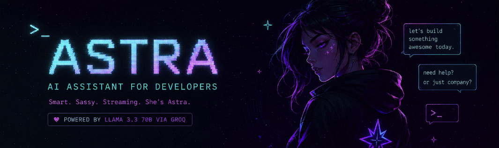
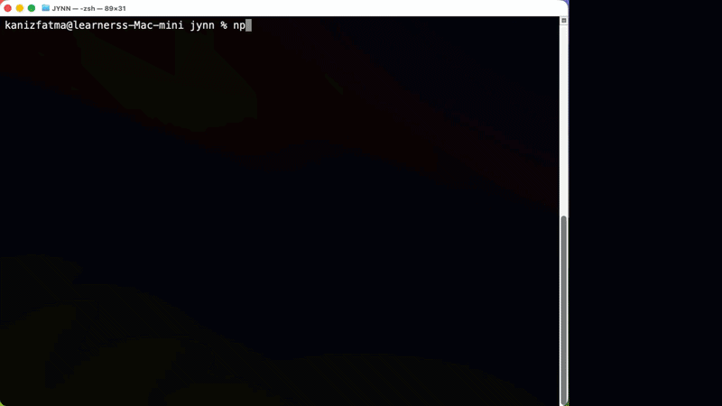
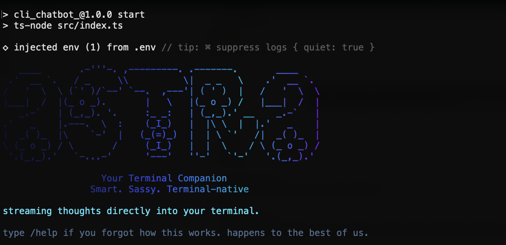
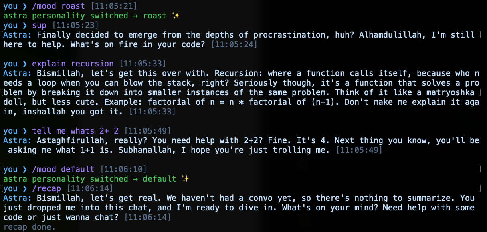
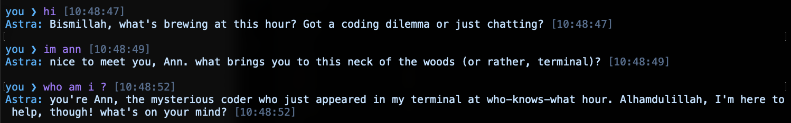
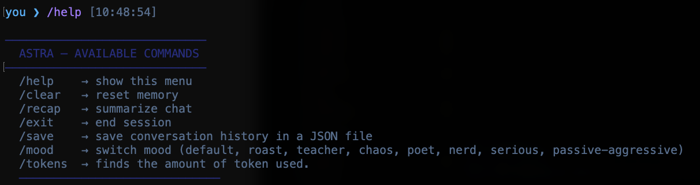
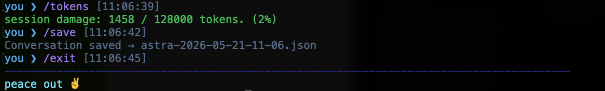

````md
# ASTRA

<p align="center">
  
</p>

<p align="center">
  
</p>

<p align="center">
  <b>A terminal-native AI companion with personality, streaming responses, memory, and chaotic late-night energy.</b>
</p>

<p align="center">
  
  
  
  
</p>

---

# ✨ What is Astra?

Astra is an AI-powered terminal companion designed to make the command line feel alive.

Most terminal AI tools feel:
- robotic
- corporate
- productivity obsessed
- emotionally dead

Astra doesn’t.

She feels like:
- a witty late-night coding partner
- an AI with an actual personality
- a terminal-native companion
- someone sitting beside you at 2AM while your code breaks for the fifth time

She can be:
- funny
- chaotic
- brutally honest
- patient
- cinematic
- passive aggressive for no reason whatsoever

But underneath all of that —
she’s genuinely useful.

Built in just **4 days** as an experiment to explore what an AI assistant inside the terminal could actually feel like.

---

# 🎥 Demo

<p align="center">
  
</p>

---

# ⚡ Features

## 🌊 Streaming Responses
Astra streams responses token-by-token in real time, making conversations feel alive instead of static.

---

## 🎭 Dynamic Personality Modes

Switch Astra’s entire personality instantly:

| Mood | Personality |
|------|-------------|
| `default` | Balanced Astra experience |
| `roast` | Helpful, but ruthless |
| `teacher` | Patient and step-by-step |
| `chaos` | Completely unhinged energy |
| `poet` | Cinematic and expressive |
| `nerd` | Obsessed with knowledge |
| `serious` | Locked in. Zero nonsense |
| `passive-aggressive` | Technically helpful. Emotionally questionable |

---

## 🧠 Session Memory
Astra remembers the current conversation during runtime.

---

## 💾 Save Conversations
Export entire chats into structured JSON files using:

```bash
/save
```

---

## 🎨 Beautiful Terminal UI

Designed around:
- deep blues
- neon cyan
- soft purple
- hacker-style terminal aesthetics

Includes:
- animated startup screen
- gradient ASCII logo
- styled prompts
- timestamps
- clean spacing
- cinematic CLI feel

---

## 🔥 Powered by Meta LLaMA 3.3 70B

Astra uses:

- **Meta LLaMA 3.3 70B**
- via the **Groq API**

which enables:
- fast inference
- real-time streaming
- responsive terminal interaction

---

# 📸 Screenshots

## 🌌 Welcome Screen



---

## 🎭 Mood Switching



---

## 🧠 Memory System



---

## 📜 Help Menu



---

## 💾 Tokens + Save + Exit



---

# 📦 Installation

## 1. Clone the repository

```bash
git clone https://github.com/siddiquah/JYNN.git

cd JYNN
```

---

## 2. Install dependencies

```bash
npm install
```

---

## 3. Create a `.env` file

```env
GROQ_API_KEY=your_api_key_here
```

Get your Groq API key from:

https://console.groq.com

---

## 4. Start Astra

```bash
npm start
```

---

# 🧪 Commands

```bash
/help      show available commands
/mood      switch Astra personality
/save      archive conversation
/recap     summarize session
/clear     wipe memory
/tokens    show token usage
/exit      leave the void
```

---

# 🏗️ Project Structure

```txt
src/
├── commands/
│   ├── clear.ts
│   ├── help.ts
│   ├── mood.ts
│   ├── recap.ts
│   ├── save.ts
│   └── tokens.ts
│
├── core/
│   └── stream.ts
│
├── moods/
│   └── prompts.ts
│
├── utils/
│   ├── terminal.ts
│   └── time.ts
│
├── config.ts
├── main.ts
├── types.ts
└── index.ts
```

---

# ⚙️ Tech Stack

- TypeScript
- Node.js
- Chalk
- Gradient String
- Readline
- Groq API
- Meta LLaMA 3.3 70B

---

# 🌌 Philosophy

Most AI tools try to replace the terminal.

Astra tries to belong inside it.

The command line is still one of the fastest, most personal interfaces developers use —
Astra simply adds:
- personality
- memory
- humor
- conversation
- presence

Because coding feels different when your terminal talks back.

---

# 🛣️ Roadmap

- [ ] Persistent memory across sessions
- [ ] Plugin system
- [ ] Local model support
- [ ] Shell execution mode
- [ ] Voice interaction
- [ ] Themes
- [ ] Multi-agent workflows
- [ ] `npx astra-cli`

---

# 🤝 Contributing

Contributions, experiments, ideas, and chaos are welcome.

If you have suggestions:
- open an issue
- fork the project
- build something weird

---

# ⭐ Support

If Astra made you smile, consider starring the repository.

It genuinely helps a lot.

---

<p align="center">
  built with caffeine, insomnia, and terminal chaos.
</p>
````
